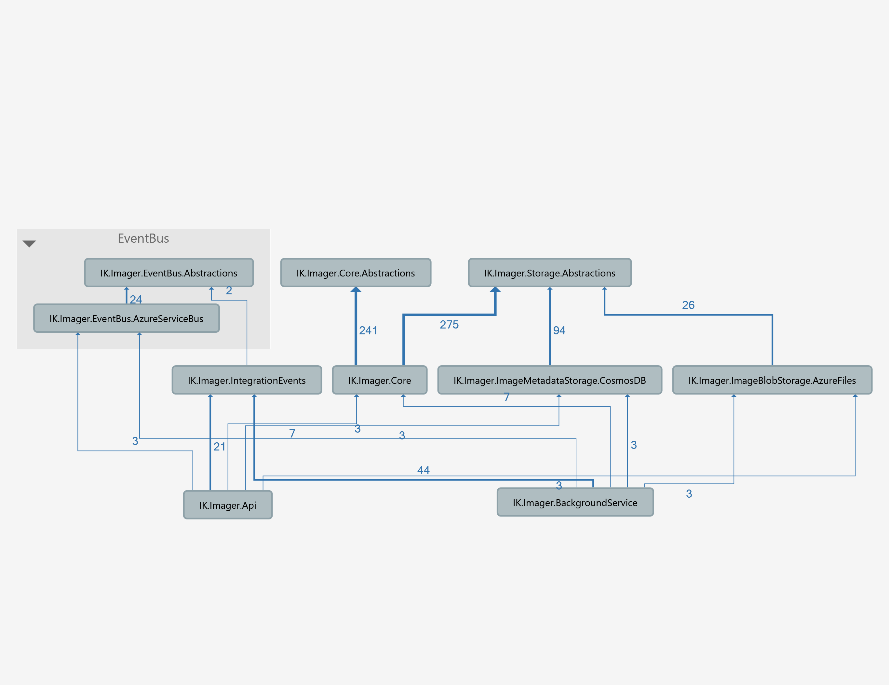

# IK.Imager

## Functionality
Quick and easy way to store, search, and manage image binary data and also image metadata, such as size, dimensions, thumbnails, and tags.

### Image Upload
There are 2 ways to upload an image to the system
1) By a given Http/Https image URL:

2) Providing binary data as a part of multipart/form-data:

### Image Validation
Before the image is saved to the data storage, it's being checked for the image size, dimensions, and format.

#### Image Format
Currently, only 4 image formats are supported: Png, Jpeg, Bmp, Gif. 
These formats are enumerated in the configuration file of the service so that it's possible to exclude some of them if needed. 

#### Image Dimensions
Image dimensions are the length and width of an image. It is usually measured in pixels.
Min and max dimensions are specified in the configuration file and therefore can be changed if necessary. 

#### Image Size
The system also verifies the given image's size and compare it with the configuration threshold values.

### Image Thumbnails
Once a new image is uploaded into the system, the background process starts to generate thumbnails, which will subsequently become available to the clients via the API. Thumbnails are generated for particular sizes specified in the configuration. An aspect ratio of an image is retained during this process.

### Image Search
A client is able to request a metadata object for any image uploaded earlier, providing an image identifier. 
A metadata object will also contain an image URL, which leads directly to the image blob storage or CDN (depending on configuration settings).

### Image Removal
Image removal is available via a simple API request. The system will clear up all related metadata and thumbnails objects.

## Docker images
[ilyakhorev/ik-imager-api](https://hub.docker.com/r/ilyakhorev/ik-imager-api)  
[ilyakhorev/ik-imager-backgroundservice](https://hub.docker.com/r/ilyakhorev/ik-imager-backgroundservice)

## Architecture Overview

The application consists of 2 microservices:
1) API microservice.
This microservice takes all responsibility for storing, removing, validating, searching images and their metadata.
Internally it communicates with Azure Blob Storage for storing image files and with Cosmos DB for storing metadata of images.

2) Background microservice. 
Main resposiblity is thumbnails generating. This process happens right after the original image is uploaded via API microservice.  
Another key functionality of the service is image removal. When removal request comes to the API, it just clears up the related metadata object, whereas the blob files of the image and its thumbnails are removed later within the background microservice.

### Technologies used
1) Azure Blob Storage. This is where image files are stored.
2) Azure Cosmos DB - used for storing metadata objects.
3) Azure ServiceBus - used for passing some events from API to the Background Service.
4) Azure Application Insights - used as a storage of application logs.
4) This microservices are written using .Net Core 3.1
5) Docker - both microservices are available as docker images on docker hub (see links above)

### Dependencies graph

