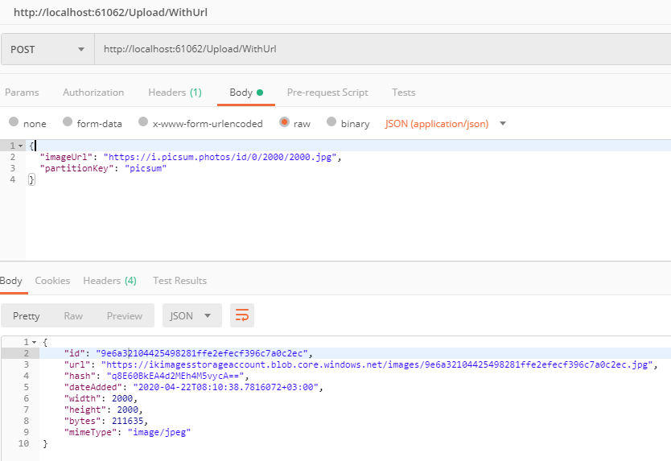
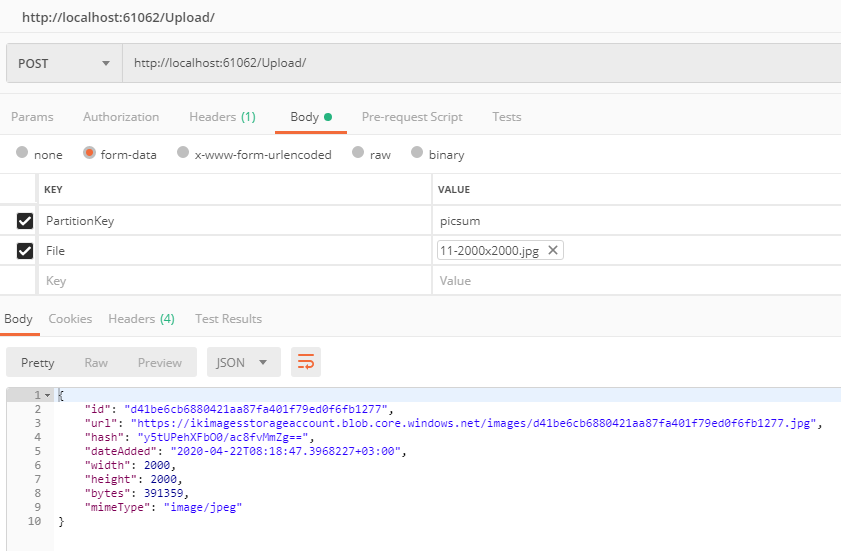
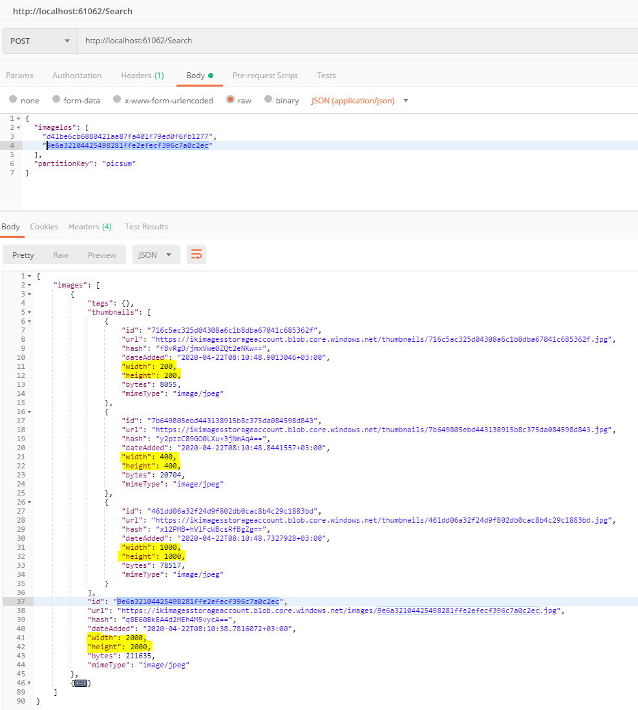
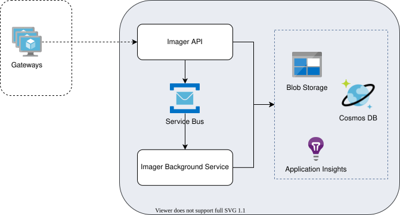

# IK.Imager

## Functionality
Quick and easy way to store, look up, and manage image binary data and also image metadata, such as size, dimensions, thumbnails, and tags.
Once a new image is uploaded, the system will automatically generate thumbnails for this image relying on the given parameters.

### Image Upload
There are 2 ways to upload an image to the system
1) By a given Http/Https image URL:

2) Providing binary data as a part of multipart/form-data:

#### Partitioning
When uploading an image, it is necessary to specify a partition key. This key is needed for Cosmos DB, which is used as metadata storage in this project. Partitioning is a way to scale incoming data and keep performance very high, so it's very important to select an appropriate partition key for your images.
It's recommended to use something meaningful, for example:
1) Let's say you want to store images from different websites. In this case, as a partition key, you may select a web site name, where the images are originally hosted. 
2) Another example would be to store product images of a particular shop. In this case, you might consider using a combination of shop id and some text phrase as a partition key, such as "shop_234".

### Image Validation
Before the image is saved to the data storage, it's being checked for the image size, dimensions, and format.

#### Image Format
Currently, only 4 image formats are supported: Png, Jpeg, Bmp, Gif. 
These formats are enumerated in the configuration file of the service so that it's possible to exclude some of them if needed. 

#### Image Dimensions
Image dimensions are the length and width of an image. It is usually measured in pixels.
Min and max dimensions are specified in the configuration file and therefore can be changed if necessary. 

#### Image Size
The system also verifies the given image's size and compare it with the configuration threshold values.

### Image Thumbnails
Once a new image is uploaded into the system, the background process starts to generate thumbnails, which will subsequently become available to the clients via the API. Thumbnails are generated for particular sizes specified in the configuration. An aspect ratio of an image is retained during this process.
Thumbnails are returned as a part of the image lookup response, together with an original image's metadata.
However, keep in mind, that there is a small delay before thumbnails are returned - the background process should generate them after an image is uploaded. Usually, it takes around 2 secs, which is absolutely fine for most use-cases. 

### Image Lookup
A client is able to request a metadata object for any image uploaded earlier, providing an image identifier. 
A metadata object will also contain an image URL, which leads directly to the image blob storage or CDN (depending on configuration settings).
PartitionKey is an optional parameter in this request. However, if you look up objects located in one partition, it's highly recommended to pass the partition key, as it will significantly improve this operation's performance.

### Image Removal
Image removal is available via a simple API request. The system will clear up all related metadata and thumbnails objects.

## Docker images
[ilyakhorev/ik-imager-api](https://hub.docker.com/r/ilyakhorev/ik-imager-api)

### Environment Variables
Connections strings and behaviour settings, defined in the configuration file, can also be passed via the following environment variables.

#### Mandatory Parameters

Below are the required parameters needed to run the service:  

Parameter  |   Description
:--- | :--- 
ServiceBus__ConnectionString   |   Connection string to Azure Service Bus
AzureStorage__ConnectionString   |   Connection string to Azure Storage account
APPINSIGHTS_INSTRUMENTATIONKEY   |   Instrumentation key of your Application Insights 
ApplicationInsights__AuthenticationApiKey   |   Authentication API key of your Application Insights 

#### Optional Parameters

Parameter  |   Default value   |   Description
:--- | :--- | :---
Logging__LogLevel__Default   |   Information   |   Minimum log level, from which logs are passed to logger providers. Only 2 logger providers are added: Console and Application Insights
Logging__ApplicationInsights__LogLevel__Default   |   Information   |   Minimum log level, from which logs are sent to Application Insights

The full list of configuration parameters can be found in the appsettings file   

[API appsettings](../master/src/IK.Imager.Api/appsettings.json)

## Architecture Overview

The application is a single service, which takes all responsibility for storing, removing, validating, looking up images and their metadata.
Internally it communicates with Azure Blob Storage for storing image files and with Cosmos DB for storing metadata of images.

The long-running operations are not performed within the original request. Instead, the service publishes an event to Azure Service Bus and handles it asynchronously in the background:
1) Thumbnails generating. This process starts right after the original image is uploaded.
2) Image files removal. When a removal request comes in, the service just clears up the related metadata object, whereas the blob files of the image and its thumbnails are removed later in the background.

### Technologies used
1) Azure Blob Storage. This is where image files are stored.
2) Azure Cosmos DB - used for storing metadata objects.
3) Azure ServiceBus - used for passing events to the background processing.
4) Azure Application Insights - used as a storage of application logs.
4) The service is written using .NET 10
5) Docker - the service is available as a docker image on Docker Hub (see link above)

### Running the tests
`dotnet test src/IK.Imager.sln` runs everything. The unit tests (`IK.Imager.Core.Tests`) are fully in-memory, whereas the storage integration tests need a running **Docker** daemon - [Testcontainers](https://dotnet.testcontainers.org/) starts Azurite and the Linux Cosmos DB emulator automatically, so no emulator has to be installed by hand. Use `dotnet test src/IK.Imager.sln --filter "Category!=Integration"` to skip them.
