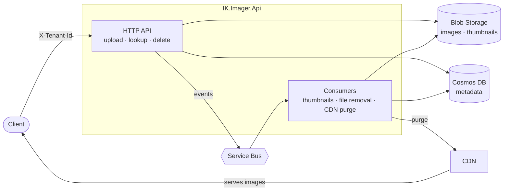

# IK.Imager


Store images and their metadata, get back a URL you can serve, and let the service generate thumbnails in the
background. A single ASP.NET Core service on top of Azure Blob Storage, Cosmos DB and Azure Service Bus.

## API

| Method | Route | Description |
|:---|:---|:---|
| POST | `/images/upload` | Upload an image as `multipart/form-data` |
| POST | `/images/upload-by-url` | Upload an image the service downloads from a URL |
| POST | `/images/lookup` | Fetch images by their ids |
| DELETE | `/images/{imageId}` | Remove an image |

Every request carries an `X-Tenant-Id` header. The full contract is served as OpenAPI at `/openapi/v1.json`,
with the Swagger UI at the root path.

## Tenancy

The tenant owns the images. Ids are unique within one, and it is the first segment of every image URL.

It arrives in the `X-Tenant-Id` header. **There is no authentication**, which means the header is not checked
against anything: the tenant is a data partitioning parameter, not a security boundary. That is fine when the
trust boundary sits at the caller — your gateway authenticates the end user, decides the tenant, and passes it
down — but it means **the service must not be reachable from the public internet**. Put it behind a private
endpoint, VNet integration or internal-only ingress. `/hc` and `/liveness` are open too.

When you do have an identity provider, nothing in the service needs rewriting. Pass an authentication hook to
`AddApiServices`, set `Tenancy__Source=Claim` and `Tenancy__ClaimType` to whichever claim carries your tenant
(`tid` on Entra ID, `org_id` on Auth0, or your own), and add `.RequireAuthorization()` to the `/images` group.
There is deliberately no abstraction over identity of our own: ASP.NET Core's `AddAuthentication` already is
one, and every provider ends at the same `ClaimsPrincipal`.

## Image ids and URLs

An image id is yours to choose. Omit it and a random one is generated.

```
{tenant}/[{collection}/][{prefix}/]{imageId}.{extension}
```

Both middle segments are opt-in per upload:

| `includeCollectionInPath` | `addUniquePrefix` | URL path |
|:---|:---|:---|
| — | — | `acme/sku-1234.jpg` |
| ✓ | — | `acme/photos/sku-1234.jpg` |
| — | ✓ | `acme/8f2c…d91a/sku-1234.jpg` |
| ✓ | ✓ | `acme/photos/8f2c…d91a/sku-1234.jpg` |

A few things worth knowing before you pick an id:

- **Ids are unique per tenant, not per collection.** A collection organises images; it does not scope their
  identity. `sku-1234` cannot exist twice in one tenant even in two different collections. If you want that,
  put it in the id: `photos-sku-1234`.
- **A duplicate id is a 409.** There is no overwrite flag. To replace an image, delete it and upload again —
  the same URL comes back.
- **Ids are rejected, never rewritten.** Lowercase letters and digits, with dots, underscores and hyphens
  allowed between them: `^[a-z0-9]([a-z0-9._-]*[a-z0-9])?$`, up to 128 characters. The point of choosing an id
  is that you can predict the URL, which silent normalisation would take away.
- **The extension comes from the image, not from you.** Read `url` off the response rather than assembling it
  from the id.
- **Images are served publicly by URL.** A generated id is 38 random characters, so its URL cannot be guessed.
  A readable id you chose can be. `addUniquePrefix` is how you keep both: a readable id and an unguessable
  URL. It does not affect uniqueness — a taken id is still a 409.

## Examples

Upload a file and let the service name it:

```bash
curl -X POST http://localhost:5000/images/upload \
  -H "X-Tenant-Id: acme" \
  -F "File=@photo.jpg"
```

```json
{
  "id": "d41be6cb6880421aa87fa401f79ed0f6fb1277",
  "url": "https://ikimages.blob.core.windows.net/images/acme/d41be6cb6880421aa87fa401f79ed0f6fb1277.jpg",
  "collection": null,
  "hash": "sQqNsWTgdUEFt6mb5y4/5Q==",
  "dateAdded": "2026-08-29T10:15:02+00:00",
  "width": 1200,
  "height": 900,
  "bytes": 210418,
  "mimeType": "image/jpeg"
}
```

Choose the id, and put it in a collection folder:

```bash
curl -X POST http://localhost:5000/images/upload \
  -H "X-Tenant-Id: acme" \
  -F "File=@photo.jpg" \
  -F "ImageId=sku-1234" \
  -F "Collection=products" \
  -F "IncludeCollectionInPath=true"
# -> url .../images/acme/products/sku-1234.jpg
```

Keep the readable id but make the URL unguessable:

```bash
curl -X POST http://localhost:5000/images/upload \
  -H "X-Tenant-Id: acme" \
  -F "File=@photo.jpg" \
  -F "ImageId=sku-1234" \
  -F "AddUniquePrefix=true"
# -> url .../images/acme/8f2c...d91a/sku-1234.jpg
```

Upload by URL — the service fetches it:

```bash
curl -X POST http://localhost:5000/images/upload-by-url \
  -H "X-Tenant-Id: acme" -H "Content-Type: application/json" \
  -d '{"imageUrl":"https://example.com/photo.jpg","imageId":"sku-1234"}'
```

Look images up by id, thumbnails included:

```bash
curl -X POST http://localhost:5000/images/lookup \
  -H "X-Tenant-Id: acme" -H "Content-Type: application/json" \
  -d '{"imageIds":["sku-1234"]}'
```

Remove one — metadata goes immediately, the files follow off the bus:

```bash
curl -X DELETE http://localhost:5000/images/sku-1234 -H "X-Tenant-Id: acme"
```

## Thumbnails

Uploading an image publishes an event; a consumer resizes the original to each width in
`Thumbnails:TargetWidth` and attaches the results to the metadata. Only widths narrower than the original
produce a thumbnail, and the aspect ratio is kept. **This takes a second or two**, so a lookup straight after
an upload returns the image with an empty `thumbnails` list.

A thumbnail's path is its original's with the width appended, so it inherits the tenant, the collection and
the unique prefix:

```
acme/products/sku-1234.jpg
  -> acme/products/sku-1234_200.jpg
  -> acme/products/sku-1234_400.jpg
```

## Validation

Requests are checked twice. The request shape — id and collection charset, URL well-formedness, at most 200
ids per lookup — is rejected with a 400 before anything is stored. The image itself is then checked against
`ImageLimitations`: format, byte size, dimensions and aspect ratio. Only JPEG, PNG, GIF, BMP, TIFF and WEBP
are accepted, and the list is configuration, so a deployment can narrow it.

`POST /images/upload-by-url` fetches an address the caller chose, so it is bounded on all four axes that
matter: the resolved IP is checked against the blocked ranges (loopback, link-local, the private ranges —
which is what stops a request reaching a cloud metadata endpoint), redirects are followed one hop at a time
and re-checked, the response is refused above `ImageLimitations:SizeBytes.Max`, and the whole exchange is
bounded by `ImageDownload:Timeout`.

## Architecture


```mermaid
flowchart LR
    client([Client])

    subgraph service["IK.Imager.Api"]
        api["HTTP API<br/>upload · lookup · delete"]
        consumers["Consumers<br/>thumbnails · file removal · CDN purge"]
    end

    blobs[("Blob Storage<br/>images · thumbnails")]
    cosmos[("Cosmos DB<br/>metadata")]
    bus{{"Service Bus"}}
    cdn["CDN"]

    client -- "X-Tenant-Id" --> api
    api --> blobs
    api --> cosmos
    api -- "events" --> bus
    bus --> consumers
    consumers --> blobs
    consumers --> cosmos
    consumers -- "purge" --> cdn
    cdn -- "serves images" --> client
```

One service handles both the HTTP API and the consumers behind it. The long-running work is not done inside
the request: uploading publishes an event that thumbnail generation hangs off, and deleting removes only the
metadata — so the image disappears from lookups at once — while the blobs are removed, and then purged from
the CDN, off the bus afterwards. Purging is its own consumer rather than a step inside deleting, because
removing a blob does not clear an edge cache and a slow purge should not hold up the delete.

Metadata is partitioned on the tenant and then the image id, which is what makes an id unique within its
tenant and keeps any one tenant clear of the 20 GB logical partition limit.

## Running it

```powershell
dotnet run --project src\IK.Imager.Api    # http://localhost:5000, Swagger UI at the root
```

Defaults point at the local emulators, so it starts against [Azurite](https://learn.microsoft.com/azure/storage/common/storage-use-azurite)
and the Cosmos DB emulator unchanged — except Service Bus, which has no emulator MassTransit 8 can drive. Set
`ServiceBus__Transport=InMemory` to run without a real namespace. In-memory has no persistence and is for
local development and tests only.

### Tests

`dotnet test src/IK.Imager.sln` runs everything. The unit tests are fully in-memory; the storage and API tests
need a running **Docker** daemon — [Testcontainers](https://dotnet.testcontainers.org/) starts Azurite and the
Linux Cosmos DB emulator automatically, so nothing has to be installed by hand. Use
`dotnet test src/IK.Imager.sln --filter "Category!=Integration"` to skip them.

## Docker

[ilyakhorev/ik-imager-api](https://hub.docker.com/r/ilyakhorev/ik-imager-api)

Configuration comes from `appsettings.json`, overridden by environment variables with `__` as the section
separator.

### Required

| Parameter | Description |
|:---|:---|
| `ServiceBus__ConnectionString` | Connection string to Azure Service Bus |
| `AzureStorage__ConnectionString` | Connection string to the Azure Storage account |
| `CosmosDb__ConnectionString` | Connection string to Cosmos DB |

### Optional

| Parameter | Default | Description |
|:---|:---|:---|
| `Tenancy__Source` | `Header` | Where the tenant is read from: `Header` or `Claim`. An unrecognised value stops the service from starting |
| `Tenancy__HeaderName` | `X-Tenant-Id` | Header carrying the tenant, when the source is `Header` |
| `Tenancy__ClaimType` | *empty* | Claim carrying the tenant, when the source is `Claim`. Required in that case |
| `Logging__LogLevel__Default` | Information | Minimum log level passed to the logger providers: a json console, plus OpenTelemetry once telemetry is configured |
| `Logging__OpenTelemetry__LogLevel__Default` | Information | Minimum log level exported to Azure Monitor |
| `Telemetry__ConnectionString` | *empty* | Application Insights connection string. Nothing is exported when unset and the service keeps running on the console alone. `APPLICATIONINSIGHTS_CONNECTION_STRING` is read as well |
| `Telemetry__EnableDependencyTracing` | false | Exports a client span for every blob call, CDN purge and image download. Off by default, because this is what makes telemetry expensive |
| `Telemetry__EnableLiveMetrics` | true | Live Metrics, which replaces the QuickPulse module of the classic SDK |
| `Telemetry__SamplingRatio` | 1.0 | Fraction of traces exported |
| `ServiceBus__Transport` | `AzureServiceBus` | `InMemory` runs the consumers without a Service Bus namespace. Local development and tests only |
| `Thumbnails__TargetWidth` | `[200, 400, 1000]` | Widths thumbnails are generated for |
| `ImageDownload__Timeout` | 00:00:30 | Bound on a whole upload-by-url fetch, retries included |
| `ImageDownload__MaxRedirects` | 5 | Redirect hops followed, each re-checked against the address rules |
| `ImageDownload__AllowPrivateAddresses` | false | Turns off the address checks, for a deployment whose image sources really are internal |
| `Cdn__Uri` | *empty* | Base URI of the CDN in front of blob storage. Image URLs point straight at blob storage when unset |
| `Cdn__Provider` | *empty* | CDN whose cache is purged when an image is deleted: `Cloudflare`, `AzureFrontDoor`, `Fastly` or `Akamai`. Nothing is purged when unset, and an unrecognised value stops the service from starting |
| `Cdn__Cloudflare__ZoneId`, `Cdn__Cloudflare__ApiToken` | *empty* | Zone and API token with the Zone · Cache Purge permission. Required for `Cloudflare` |
| `Cdn__AzureFrontDoor__SubscriptionId`, `__ResourceGroupName`, `__ProfileName`, `__EndpointName` | *empty* | Locate the Front Door endpoint. Required for `AzureFrontDoor`, which authenticates with `DefaultAzureCredential` |
| `Cdn__Fastly__ApiToken` | *empty* | API token with the `purge_select` scope. Required for `Fastly` |
| `Cdn__Akamai__Host`, `__ClientToken`, `__ClientSecret`, `__AccessToken` | *empty* | EdgeGrid credentials of an API client with the Fast Purge permission. Required for `Akamai` |

The full parameter list is [the appsettings file](../master/src/IK.Imager.Api/appsettings.json).

Health endpoints: `/hc` (Cosmos, blob storage and the bus) and `/liveness` (self only).
