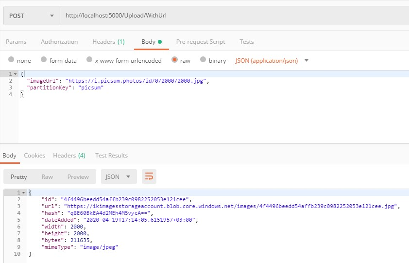
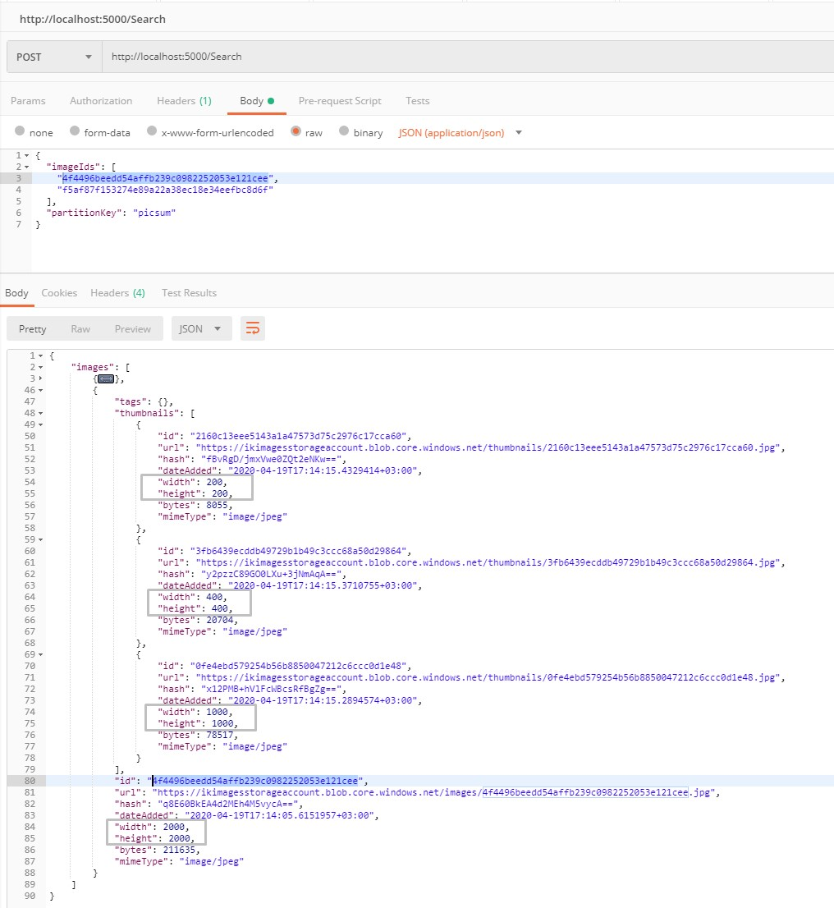

# IK.Imager

Current status: development  
1st beta version: April 2020

## Functionality
The system allows to easily store and manage image binary data and image metadata, such as size, dimensions, thumbnails, and related tags.

### Image Upload
There are 2 ways to upload an image to the system
1) By a given http/https image URI
2) Providing a binary data as a part of multipart/form-data

### Image Validation
Before the image is saved to the storage, it's being checked for the following image formats: Png, Jpeg, Bmp, Gif.  
Besides, the system verifies the given image's size and dimenesions and compare them with the configuration threshold values.

### Image Thumbnails
Once a new image is uploaded into the system, the background process starts to generate thumbnails, which will subsequently become avaiable to the clients via API. Thumbnails are generated for particular sizes specified in the configuration.

### Image Search
A client is able to request a metadata object for any image uploaded earlier providing an image identifier. 
A metadata object will also contains image url, which leads directly to the image blob storage or CDN (depending on configuration)

### Image Removal
Image removal is available via a simple API request. The system will clear up all related metadata and thumnails objects.

## Architecture Overview

The application consists of 2 microservices:
1) API microservice. Considered as a bridge between gateways and image storage. 

2) Backround microservice. Used for thumbnails generating that happens right after the original image is uploaded.

Technologies used:
1) Azure Blob Storage
2) Azure Cosmos DB
3) Azure ServiceBus
4) Asp.Net Core 3.1
5) Docker
